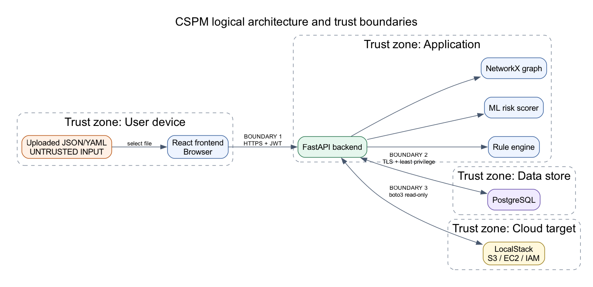

# AI-Powered Cloud Security Posture Management

A full-stack cybersecurity platform for analyzing uploaded cloud configurations and emulated live AWS environments. The planned system combines benchmark-mapped rules, ML-based risk prioritization and anomaly detection, compliance reporting, and attack-path visualization.

The repository has completed **Phase 2: backend API and database foundation**. It includes the Phase 0 local environment, the Phase 1 secure parser/rule engine, and Phase 2 FastAPI scan endpoints with SQLModel models and Alembic migrations.

## Architecture



The browser communicates with FastAPI, which will orchestrate the rule engine, ML scorer, and NetworkX graph engine. PostgreSQL stores application state, while boto3 connects the API to LocalStack during local development. Uploaded JSON/YAML is treated as untrusted input.

See [the schema](docs/schema.md), [the threat model](docs/threat-model.md), and [the full project plan](guides/Major%20Project%20Planning.md).

## Planned technology stack

- React and Tailwind CSS
- Python 3.11, FastAPI, and Pydantic
- PostgreSQL with SQLModel/SQLAlchemy
- boto3 and LocalStack
- NetworkX, scikit-learn, and XGBoost
- Docker Compose and GitHub Actions

## Prerequisites

- Git
- Docker Desktop with Docker Compose v2
- Python 3.11 for backend development and Node.js LTS for later development phases

Docker is the easiest runtime for the full backend stack because it starts PostgreSQL, LocalStack, runs database migrations, and serves FastAPI. Python is needed for local backend tests. Use Python 3.11 for full backend dependency installation; newer unreleased/interpreter-edge versions may not have wheels for all pinned packages.

## Run the backend stack

```bash
git clone <repository-url>
cd cloud-security-posture-management
cp .env.example .env
cd infra
docker compose up --build -d
```

Compose waits for PostgreSQL and LocalStack to become healthy before starting the API. Check all services:

```bash
docker compose ps
curl --fail http://localhost:8000/health
```

The API response should be:

```json
{"status":"ok"}
```

Verify PostgreSQL and LocalStack:

```bash
docker compose exec postgres pg_isready -U postgres -d cspm
docker compose run --rm backend python /scripts/test_s3.py
```

The backend container runs `alembic upgrade head` before starting FastAPI, so the database tables and seeded compliance map are created automatically. The LocalStack smoke test creates `cspm-phase-zero-smoke-test` and confirms it can be listed. Local services are exposed at:

| Service | Address |
| --- | --- |
| FastAPI health endpoint | <http://localhost:8000/health> |
| FastAPI OpenAPI UI | <http://localhost:8000/docs> |
| PostgreSQL | `localhost:5432` |
| LocalStack gateway | <http://localhost:4566> |

Stop the environment without deleting its named volumes:

```bash
docker compose down
```

## Run backend tests

```bash
python3.11 -m venv .venv
.venv/bin/python -m pip install -r backend/requirements-dev.txt
./scripts/run_tests.sh
```

The test suite validates the secure parser, all five starter rules, API upload/read endpoints, database persistence, and user-scoped access checks.

To verify migrations without Docker:

```bash
cd backend
DATABASE_URL=sqlite:///./local_migrations.db alembic upgrade head
rm local_migrations.db
```

## Repository structure

```text
backend/   FastAPI application and backend Dockerfile
frontend/  React application (Phase 3)
ml/        Dataset and model work (Phase 5)
infra/     Local Docker Compose environment
rules/     Declarative security rules (Phase 1)
docs/      Architecture, schema, and threat model
scripts/   Development smoke-test utilities
guides/    Project plan and execution guide
```

## Security

Never commit `.env`, cloud credentials, database passwords, model artifacts, or tokens. Copy `.env.example` locally and replace its development-only placeholders. Report vulnerabilities according to [SECURITY.md](SECURITY.md).

GitHub repository settings should require pull requests and one approval on `main`, enable Dependabot alerts and security updates, enable secret scanning and push protection, and enable private vulnerability reporting. The checked-in Dependabot and gitleaks configurations provide weekly dependency updates and secret scanning on pull requests and pushes to `main`.
