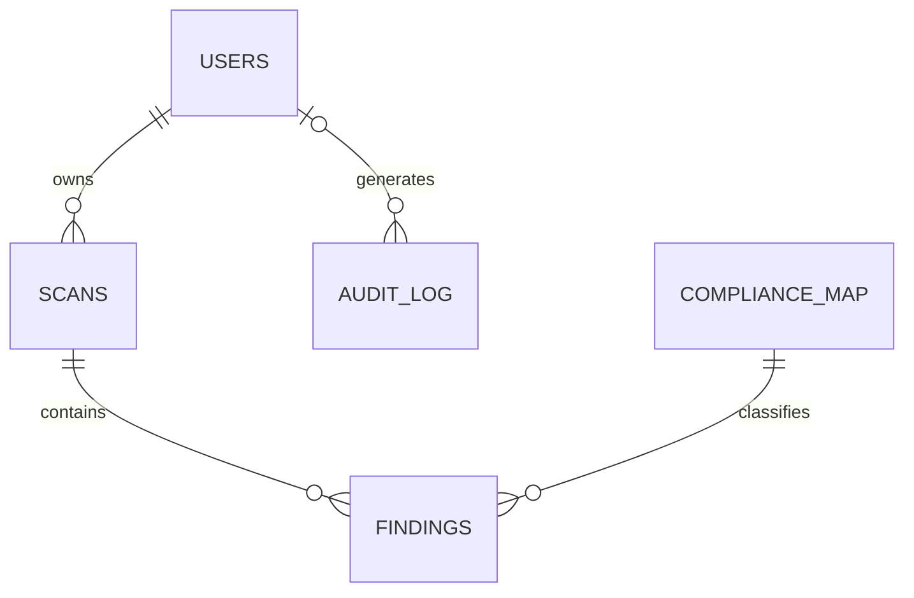

# Database Schema

This is the agreed logical schema for later implementation with PostgreSQL and SQLModel. Phase 0 defines the contract; migrations and models are Phase 2 work.

The planning specification names five tables. The execution guide refers to “six tables” but lists the same five, so this document intentionally defines the five specified tables.

## Enumerations

| Enum | Values |
| --- | --- |
| `user_role` | `ADMIN`, `VIEWER` |
| `scan_type` | `STATIC`, `LIVE` |
| `scan_status` | `IN_PROGRESS`, `COMPLETED`, `FAILED` |
| `severity` | `LOW`, `MEDIUM`, `HIGH`, `CRITICAL` |

## Tables

### `users`

| Field | Type | Constraints |
| --- | --- | --- |
| `user_id` | UUID | Primary key |
| `email` | VARCHAR(320) | Unique, not null |
| `password_hash` | TEXT | Not null; Argon2id hash only |
| `role` | `user_role` | Not null, default `VIEWER` |
| `created_at` | TIMESTAMPTZ | Not null, server default current time |

### `scans`

| Field | Type | Constraints |
| --- | --- | --- |
| `scan_id` | UUID | Primary key |
| `user_id` | UUID | Foreign key → `users.user_id`, not null, indexed |
| `scan_type` | `scan_type` | Not null |
| `timestamp` | TIMESTAMPTZ | Not null, server default current time |
| `status` | `scan_status` | Not null, default `IN_PROGRESS` |

### `compliance_map`

| Field | Type | Constraints |
| --- | --- | --- |
| `rule_id` | VARCHAR(100) | Primary key |
| `cis_control_id` | VARCHAR(50) | Not null; identifier only |
| `nist_id` | VARCHAR(50) | Not null |
| `remediation_steps` | TEXT | Not null |

### `findings`

| Field | Type | Constraints |
| --- | --- | --- |
| `finding_id` | UUID | Primary key |
| `scan_id` | UUID | Foreign key → `scans.scan_id`, not null, indexed |
| `resource_id` | TEXT | Not null |
| `resource_type` | VARCHAR(150) | Not null |
| `severity` | `severity` | Not null |
| `rule_id` | VARCHAR(100) | Foreign key → `compliance_map.rule_id`, not null |
| `risk_score` | SMALLINT | Nullable; check from 0 through 100 |
| `is_anomaly` | BOOLEAN | Not null, default `FALSE` |

### `audit_log`

| Field | Type | Constraints |
| --- | --- | --- |
| `event_id` | UUID | Primary key |
| `user_id` | UUID | Nullable foreign key → `users.user_id`, indexed |
| `action` | VARCHAR(100) | Not null |
| `ip_address` | INET | Nullable |
| `timestamp` | TIMESTAMPTZ | Not null, server default current time |

## Relationships

Deletion policy will be finalized with the Phase 2 migrations. Application queries must always scope scans and findings to the authenticated user or organization.
